Reference🎉:[**一个8位二进制CPU的设计和实现**](https://www.bilibili.com/video/BV1aP4y1s7Vf/) 

Software:[**Logic Circuit**](https://logiccircuit.org/) 

	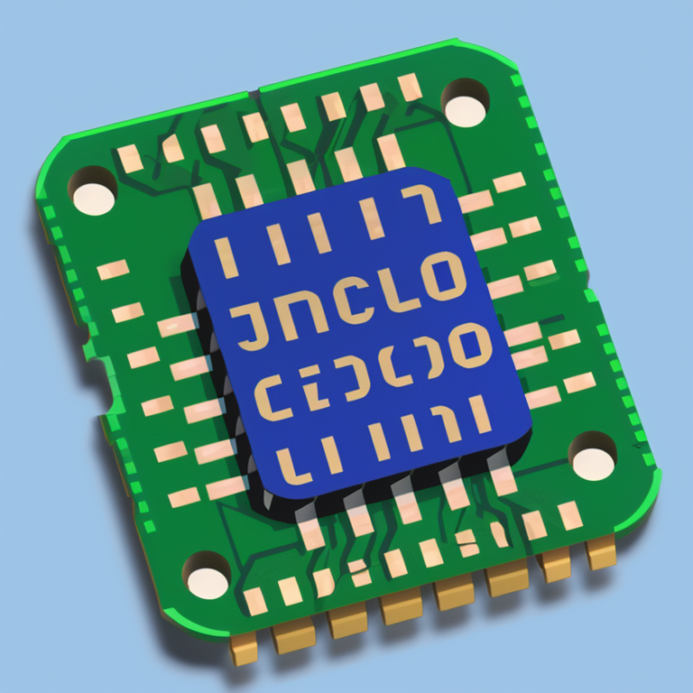

# 一只8位CPU的诞生(simulation)

…

## 半加器

| A    | B    | C    | S    |
| ---- | ---- | ---- | ---- |
| 0    | 0    | 0    | 0    |
| 0    | 1    | 0    | 1    |
| 1    | 0    | 0    | 1    |
| 1    | 1    | 1    | 0    |

$$
S = A'B+AB' 
$$

$$
C = AB
$$

…

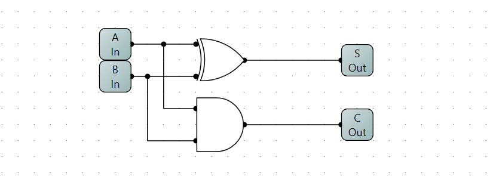 

…

## 全加器

### 1.逻辑表出

| C_in | A    | B    | S    | C_out |
| ---- | ---- | ---- | ---- | ----- |
| 0    | 0    | 0    | 0    | 0     |
| 0    | 0    | 1    | 1    | 0     |
| 0    | 1    | 0    | 1    | 0     |
| 0    | 1    | 1    | 0    | 1     |
| 1    | 0    | 0    | 1    | 0     |
| 1    | 0    | 1    | 0    | 1     |
| 1    | 1    | 0    | 0    | 1     |
| 1    | 1    | 1    | 1    | 1     |

$$
S = C_{in}'A'B+C_{in}'AB'+C_{in}A'B'+C_{in}AB
$$

$$
C_{out} = C_{in}'AB+C_{in}A'B+C_{in}AB'+C_{in}AB
$$

略…

### 2.半加器级联

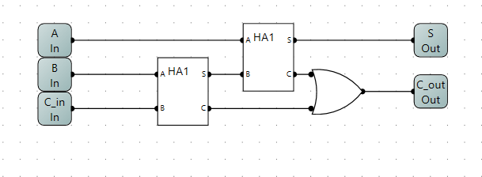

### 3.ROM查找表

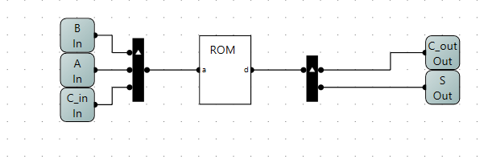

利用上面的逻辑表出式可以得出下面的查找表：
$$
地址:C_{in}*4 + A * 2 * B ,数据： S * 2 + C_{out}
$$
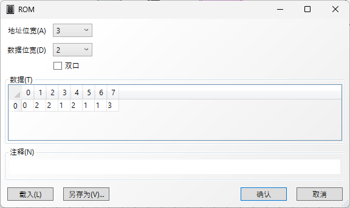

## 加法器

### 8位二进制串行加法器

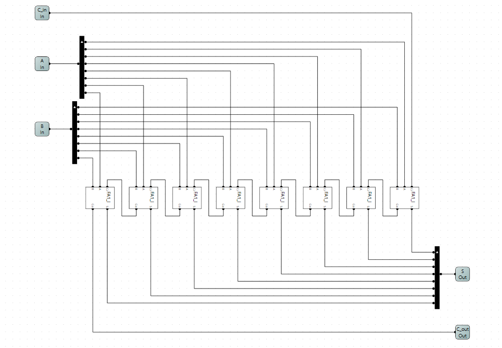

### 测试电路

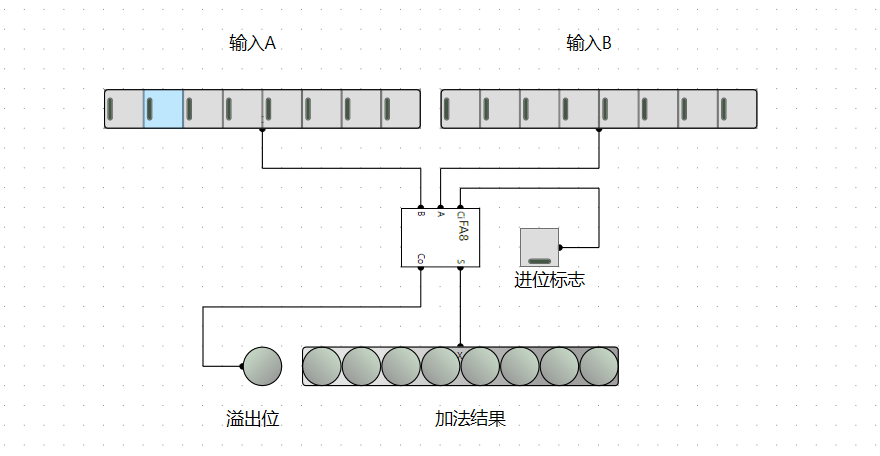

## 减法器

由加法器的特性可以知道：1 + 255 = 0, 3+255 = 2 **(忽略进位)**，这意味着对应8位的无符号数 +255 和 -1 是等价的。

同理 5 + 254 = 5 + 255 - 1 = (5 + 255) - 1 = 4 - 1 = 3，这就意味着+254和 -2 是等价的。

在二进制表示中 255和0是互相按位取反的，254和1是互相按位取反的。那么

3 - 1 = 3 + 255 = 3 + **254** +1 ==>> 3 + **~1** + 1 (‘~x’的意思是对x取反) 

3 - 1 = 3 + (~1 + 1)，**(~1 + 1)就是-1的补码 ** 

利用加法器和溢出的特性进行减法运算

我们要做出减法器实现 A-B，就要先求出 -B的补码C 再做A+C就可以完成运算了。

…

先实现一个取反器，

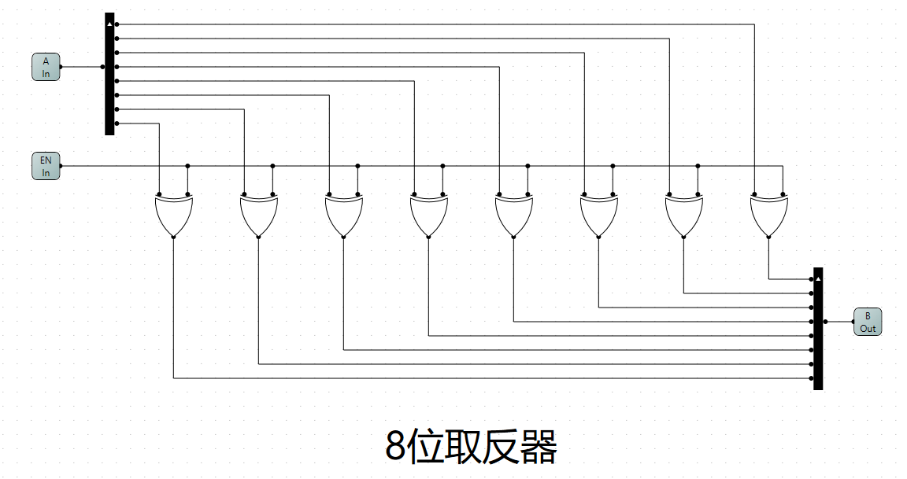

**EN** 0:不取反 1:取反

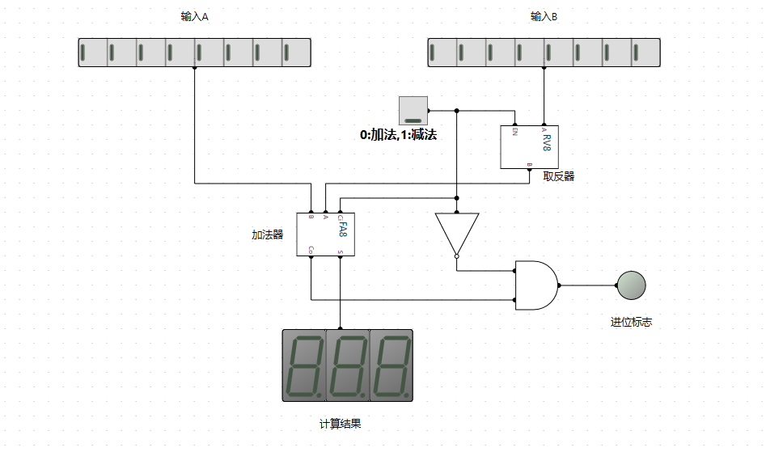

…

## 数码管

暂略。。。

## RS触发器

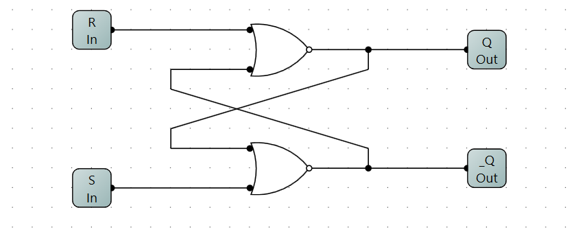 

| R    | S    | Q    | Q’   |
| ---- | ---- | ---- | ---- |
| 0    | 0    | Q    | Q’   |
| 1    | 0    | 0    | 1    |
| 0    | 1    | 1    | 0    |
| 1    | 1    | 0    | 0    |

## D触发器

暂略。。。

## D边缘触发器

暂略。。。

## T触发器

暂略。。。

## 3-8译码器

…

…

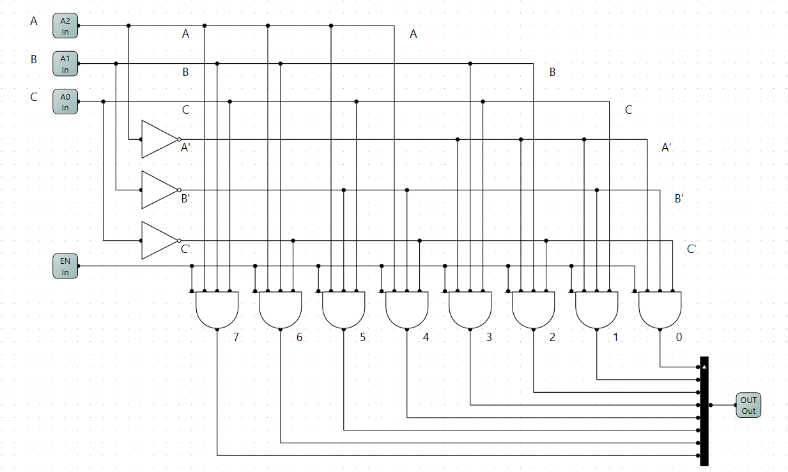

## 存储器

暂略。。。

## 存储器扩展

### 字扩展

### 位扩展
